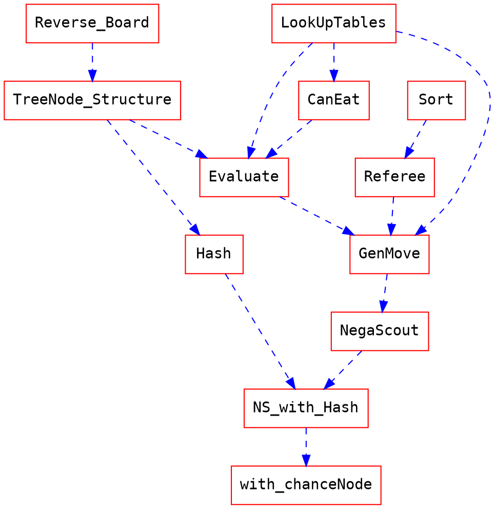

# TCG Final

## 1. Implementation
### How to compile
`make`

### Algorithms
#### 0. Overview
這次的final project，我利用助教提供的sample code：depth3 MGTP修改而成了有著下列1~6功能的AI Agent。
#### 1. NegaScout algorithm
這次我根據老師投影片的內容實做了兩個演算法：MiniMax版本的NegaScout和NegaMax版本的NegaScout。
其中，MiniMax的版本因為分成了min node及max node，可讀性相對較高，也比較好debug，所以後續功能的實作都是做在Minimax上面。NegaScout本身只具備搜尋5層左右的實力。

#### 2. Chance node search
取名方式與老師投影片相同，叫做Star1_F3。為了加快搜尋速度，在相信自己做好了move ordering的情況下我只會去看排名前十的node。
另外的一個發現是：為了Min node的chance node search Star1_G3在寫出來之後發現跟Star1_F3長得一模一樣。差別僅在於回傳回來的m在放進transposition table時的label不同而已。
#### 3. Hash table
利用Zobrist Hashing，我建了一張$2^{25}$大小的Hash Table。這個Hash Table有著自己的資料型態entry，定義在MyAI.h當中。
每個entry都會包含以下幾個值：
1. 用來比對cache hit時是否為同意張盤面的64bit的unsigned integer password
2. 當前的最佳值 m
3. 深度 depth
4. 用來判斷儲存的m是exact value 還是 上下界的 3-way flag exact
5. 最佳走步 PV

hashing的初始化發生在呼叫14 ready時。使用的random generator是mt19937_64。
#### 4. Move ordering
對於 Move ordering我將其分成了三個部分：吃子棋，走步棋及翻子棋。
##### 吃子棋 / 走步棋
我們的排序重點放在吃子棋時吃的棋子子力，以及走步棋時移動棋子的子力。
大子優先，這裡的大子跟審局函數的子力價值有所不同。在審局函數時，士的價值比炮要大，但在move ordering時炮要優先於士的移動。這是由於我認為士的主要價值在於威懾和牽制以及最後收官，但是炮的價值在最後棋子少時較難體現出來。
具體而言是這種感覺：
|兵/卒|炮/包|傌/馬|車/俥|象/相|士/仕|將/帥|
| -- | -- | --  | -- | -- | --  | -- |
|  7 |  2 | 6   | 5  |  4 | 3   | 1  |
(數字越小優先度越高)
##### 翻子棋
我的翻子棋做得很爛，我自己知道這件事。
為了增加翻子棋正確翻棋的成功率，我給出了以下幾點heuristic
1. 絕對不要翻對方的炮口位置
2. 盡量翻自己的炮口位置
3. 盡量翻對方的炮旁邊的位置
4. 盡量翻能炮殺對方大棋的位置
6. 基本的翻棋位置優先度

除了第六點是建立look up table以外，其他幾點皆是在Expand function做搜尋的。雖然有做reverse look up table，但其實成本不低。
為了節省成本，丟進minimax時只會去考慮前10優先的棋。

### Heuristic Functions
#### 1. Opening heuristic
開場時由於被蓋住的棋子很多，若是一個個去做chance node搜尋會浪費掉很多開局時間。於是我做了一個很簡單的開局heuristic。一共就只有先手的第一步及後手的第一步而已。先手方的第一步根據上課時提出過的統計結果選擇下在那四個對稱位置的其中一個。由於哪個都沒關係，就固定在b2上了(debug也比較方便)
後手方則由於一定跟先手方翻出的第一顆子不同顏色，我就建了一張表使得AI會去翻能炮殺那顆子的位置。
如附表：
表中的數值即是當第一手翻了著個格子的位置之後第二手應該翻的地方。
|  8 |  9 | 10 | 11 |
| -- | -- | -- | -- |
| 12 | 13 | 14 | 15 |
| 16 | 17 | 18 | 19 |
| 20 | 21 | 22 | 23 |
|  8 |  9 | 10 | 11 |
| 12 | 13 | 14 | 15 |
| 16 | 17 | 18 | 19 |
| 20 | 21 | 22 | 23 |

#### 2. End game heuristic
我的Endgame階段共分成四個子階段，和一個觸發。
每一階段除了子力價值的變動以外大同小異。除了原本的審局函數外，另外判斷攻方和守方。
其中，守方的策略是逼和。這個策略也讓我在正式比賽時**一場未輸**。
攻方的話，在原有的審局函數中額外增加了
1. 絕對不要進入炮道
2. 減少對方的可移動路線
3. 站在對方的斜對角位置(限制移動避免重複走步)

使用了幾張lookup table
##### 觸發
當場上剩餘未翻開棋數小於等於3時，進入收官階段。
##### 殺炮階段
敵方棋子價值：
|兵/卒|炮/包|傌/馬|車/俥|象/相|士/仕|將/帥|
| -- | -- | --  | -- | -- | --  | -- |
| 40 | 1000 | 50 | 50  |  300 | 600   | 800  |
##### 殺將階段
|兵/卒|炮/包|傌/馬|車/俥|象/相|士/仕|將/帥|我方兵/卒|
| -- | -- | --  | -- | -- | --  | -- |--|
| 40 |  600 | 50 | 50 | 300 | 600 | 1000 |400|
##### 殺士階段
|兵/卒|炮/包|傌/馬|車/俥|象/相|士/仕|將/帥|
| -- | -- | --  | -- | -- | --  | -- |
| 40 | 600 | 50 | 50  | 300 | 1000 | 800 |
##### 殺光階段
|兵/卒|炮/包|傌/馬|車/俥|象/相|士/仕|將/帥|
| -- | -- | --  | -- | -- | --  | -- |
| 900 | 990 | 950 | 960 | 970 | 980 | 1000 |
### Code Structure
Structures, Macros, and Lookup tables are located in `MyAI.h`
Implementations are located in `MyAI.cpp`
other tools are located in `chart.cpp`
#### Implementation Road Map

## 2. Experiments
#### What are useful
Requirements的那些都非常的有用，幫我的程式加速了很多。
opening跟ending heuristic則直接為我迴避掉了開局用時過多及容易和局的後果。

除此之外，正式比賽時有一輪在兩場必勝的盤面都因為同一個原因而和局了。
當對手有一顆棋子被困在由為翻開的棋子組成的牆內時，因為翻棋時的Expected value是負的，所以我方不會主動去翻棋，最後被60手無吃翻給判和。
我在中間hotfix了這個問題，之後的戰力就有顯著提升。
還有是我做的改良版Killer Heuristic。在免去搜索無意義走不上貢獻良多。
#### What are not
花時間把Minimax版本換成Negamax版本其實沒什麼幫助。
我有實驗在end game heuristic時，過分要求追棋子反而會造成容易進入循環走步的不良後果。
還有killer heuristic。第十步以後的可能性備選到的機會真的不大。

#### winning rate of the agent
這次比賽的結果如下：

拿到了班上的第13名，但前三輪可能不能算入我的win rate，因為我記錯比賽時間了，前三輪是由dummy agent幫我代打的。
**助教有看到這個的話“非常對不起！”**
我早上有助教時間和實驗室會議實在也是走不開身。對不起！

|第一輪*|第二輪*|第三輪*|第四輪|第五輪|第六輪|第七輪|
| -- | -- | --  | -- | -- | --  | -- |
|負/負|和/和|和/和|和/和|和/和|勝/勝|和/勝|

很開心最後有進班上前半。這是我對爆搜3層的baseline AI戰績：

## 3. Discussion
### What I have learned from this project
老實說我原本不看好自己能完成這項作業的。我身上的雜事不少，甚至到比賽當天都辦法從早待到下午(對不起)。但就如同老師上課時說的，花時間在這個final project上也是一種tradeoff，我最後選擇了我認為對自己最有幫助的路線，完成了agent設計並完成了比賽而且我非常滿意。

這些撇開不談，這堂課在技術方面確實是如同寶箱一般。我很難想起我上次這麼頻繁地使用gdb是什麼時候了。一些概念上的演算法，像iterative deepening，也偶爾會在遇到生活難題時被我想起。多多少少，我腦中的move ordering也被重新設計過了吧？
### Possible improvments of my code
有不少我在倒數第二天想到的改進方法，可惜我在比賽前一天有要事而沒能實現。其中包括：
1. Iterative deepening
2. End game manhatten distance
3. Flip ordering

Iterative deepening 是在觀察到我的用時不一而產生的想法。往往他在不重要的地方花太多深度，在快超時卻又不會加速思考。
End game manhatten distance是我想加進end game heuristic的審局。這應該能避免幾次都不去追剩下的最後一顆棋的情況。
Flip ordering我原本想新增往接近我方士或敵方帥的翻子順序，最後由於時間因素而放棄了，有興趣的同學可以自己試試看。
